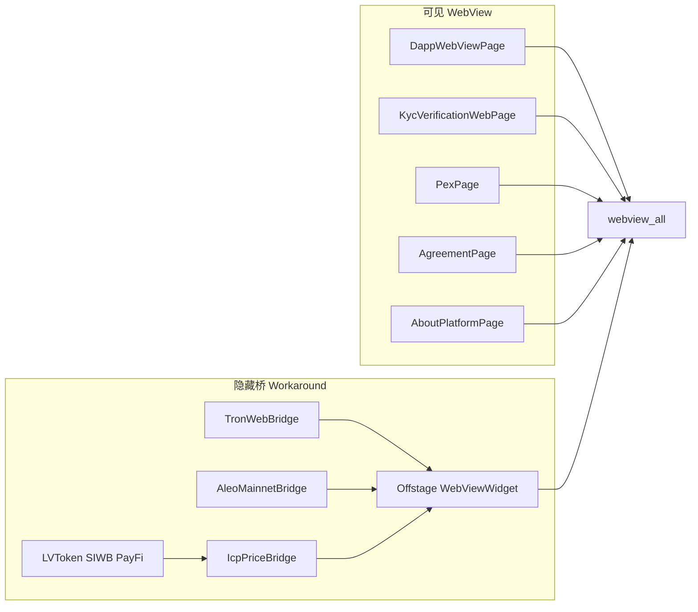

# webview_all 替换评估：暂不迁移（忽略鸿蒙）

**评估范围：** Android / iOS / macOS / Windows / Linux / Web。**不考虑鸿蒙 / OHOS / 华为 WebView SIGTRAP。**

**结论：忽略鸿蒙后，技术上可以用 Workaround 替换；当前仍不改代码。** 可见页面可直接映射到 `webview_all`；隐藏链上桥可用 Overlay/Offstage `WebViewWidget` 代替 `HeadlessInAppWebView`。真正值得向上游要的是：await Promise 的 JS API、document-start UserScript、全局 Website Data 清理。按你确认的方向：**不改 [pubspec.yaml](pubspec.yaml)、不重构业务代码**，只更新评估与 Feature Request。



## 1. 现状与依赖

- 声明：[pubspec.yaml](pubspec.yaml) L126 `flutter_inappwebview: ^6.1.5`。无自定义 plugin 配置、无 ProGuard keep 规则。
- 目标平台门槛：Android `minSdk 26`、`usesCleartextTraffic=true`；iOS 15.0；相机/麦克风权限已声明。`webview_all` 最低 Android API 24 / iOS 13，宿主满足。
- 当前无头实现：[lib/pages/browser/common/webview/web_sdk_bridge.dart](lib/pages/browser/common/webview/web_sdk_bridge.dart) 的 `HeadlessInAppWebView.run()`。`HiddenWebView` 未挂到 widget 树。原「一次只起一个桥」是为鸿蒙写的，**本评估不再作为约束**；Android/iOS 可同时保活 Aleo / Tron / ICP 三个隐藏 WebView。

**直接 import 的文件（23 个 Dart 文件）：**

- 可见 Widget：`dapp_webview_page.dart`、`kyc_verification_web_page.dart`、`pex_page.dart`、`agreement_page.dart`、`about_platform_page.dart`
- 无头桥：`web_sdk_bridge.dart`、`web_sdk_controller.dart`
- 仅持有 `InAppWebViewController` 类型：`send_chat_web3_sheet.dart`、`send_conference_red_packet_sheet.dart`、`token_ui_state.dart`、`payfi_wallet_guard.dart`、`api_manager.dart`、`token_api_manager.dart`
- JS 业务：`lv_token_service.dart`、`platform_coin_service.dart`、`siwb_service.dart`、`siwb_session_injector.dart`、`payfi_token_options.dart`、`payfi_internal_transfer_service.dart`、`icp_transaction_service.dart`
- 工具：`webview_upload_helper.dart`、`webview_data_service.dart`、`agreement_html_loader.dart`

**现网实际用到的 inappwebview 能力：**

- Widget / 无头：`InAppWebView`、`HeadlessInAppWebView`、`InAppWebViewKeepAlive`
- 生命周期：`onWebViewCreated`、`onLoadStart`、`onLoadStop`、`onProgressChanged`、`onUpdateVisitedHistory`、`onReceivedError`、`onConsoleMessage`、`onRenderProcessGone`
- 导航 / 权限：`shouldOverrideUrlLoading`、`onPermissionRequest`、`onReceivedServerTrustAuthRequest`
- JS：`evaluateJavascript`、`callAsyncJavaScript`（带 `arguments`）、`addJavaScriptHandler` + `window.flutter_inappwebview.callHandler`
- 注入：`UserScript` + `AT_DOCUMENT_START`
- 设置：`javaScriptEnabled`、`userAgent`、`allowsInlineMediaPlayback`、`mediaPlaybackRequiresUserGesture`、`allowsBackForwardNavigationGestures`、`transparentBackground`、`mixedContentMode`、`allowFileAccessFromFileURLs`
- 存储：`CookieManager.deleteAllCookies`、`InAppWebViewController.clearAllCache`、`WebStorageManager`
- 未使用：下载拦截、自定义 `onShowFileChooser`

## 2. API 映射

`webview_all` 顶层 API 对齐 `webview_flutter`，不是 inappwebview。

- `InAppWebView` → `WebViewWidget(controller:)`
- `InAppWebViewController` → `WebViewController`
- `HeadlessInAppWebView` → **无官方 API**；Workaround：把 `WebViewWidget` 放进 Overlay / `Offstage` / `IgnorePointer` + 1×1（或 `Opacity(0)`），仍走同一套 `WebViewController`
- `InAppWebViewSettings(javaScriptEnabled: true)` → `setJavaScriptMode(JavaScriptMode.unrestricted)`
- `loadUrl` / `initialUrlRequest` → `loadRequest(Uri)`
- `loadData` / `InAppWebViewInitialData` → `loadHtmlString` / `loadFlutterAsset`
- `evaluateJavascript(source:)` → `runJavaScript` / `runJavaScriptReturningResult`（**不等待 Promise**）
- `callAsyncJavaScript(functionBody, arguments)` → **无官方 API**；Workaround：专用 `JavaScriptChannel` + `Completer`，JS 里 `await` 完再 `Channel.postMessage(JSON.stringify(result))`
- `addJavaScriptHandler` + `callHandler` → `addJavaScriptChannel` + `Channel.postMessage`（单向；Dart 返回值改为再 `runJavaScript` 调 `__niceWalletResolve`，DApp 已是这种模式）
- `UserScript AT_DOCUMENT_START` → **公共 API 无**；Workaround：`onPageStarted` 立刻 `runJavaScript` + 现有 burst 注入；iOS 可再试 `WebKitWebViewController` 平台 UserScript（需验证是否导出）
- `shouldOverrideUrlLoading` → `NavigationDelegate.onNavigationRequest`（`ALLOW/CANCEL` → `navigate/prevent`）
- `onLoadStart/Stop/Progress/UpdateVisitedHistory/ReceivedError` → `onPageStarted/Finished/Progress/UrlChange/WebResourceError`
- `onConsoleMessage` → `setOnConsoleMessage`
- `onPermissionRequest` → `WebViewController(onPermissionRequest:)` + `grant()` / `deny()`
- `onReceivedServerTrustAuthRequest(PROCEED)` → `onSslAuthError` + `error.proceed()`（ICP 本地 http 桥可保留 proceed；生产外网页应 cancel）
- `onRenderProcessGone` → **无**；Workaround：`onWebResourceError` 后重建 controller
- `setSettings(userAgent:)` → `setUserAgent` / `getUserAgent`
- `transparentBackground` → `setBackgroundColor(Colors.transparent)`
- iOS 内联播放 / 手势返回 → `webview_all_wkwebview` 的 `WebKitWebViewController`
- Android mixed content / file access / 媒体手势 / 文件选择 → `webview_all_android` 的 `AndroidWebViewController`（`setMixedContentMode`、`setOnShowFileSelector`）
- `CookieManager.deleteAllCookies` → `WebViewCookieManager.clearCookies()`
- `InAppWebViewController.clearAllCache` → 对每个活着的 `WebViewController.clearCache()`
- `WebStorageManager` → **无全局 API**；Workaround：对每个隐藏/可见 controller `runJavaScript('localStorage.clear(); sessionStorage.clear();')` + `clearCookies` + `clearCache`
- `canGoBack` / `goBack` / `reload` → 同名
- `gestureRecognizers`（PEX）→ `WebViewWidget.gestureRecognizers`
- 文件上传：Android 用 `setOnShowFileSelector`；**iOS 无通用回调**，走系统默认选择器（与当前「插件内置选择器」接近）

## 3. 差距重评（忽略鸿蒙）

**不再视为硬阻塞：**

- **无头 WebView。** Overlay/Offstage `WebViewWidget` 在 Android / iOS / 桌面是合理 Workaround。三个桥可同时挂在根 Overlay，不必「一次只起一个」。代价：多几个不可见 platform view，内存与生命周期要自己管（`dispose` 时 `controller` 置空、从 Overlay 摘掉）。
- **`InAppWebViewKeepAlive`（PEX）。** 页面已有 `AutomaticKeepAliveClientMixin`；Tab 保活可继续靠 Flutter State，不强制原生 keepAlive。
- **双向 `callHandler`。** DApp 已用 `postMessage` + `__niceWalletResolve`；TRON handler 返回值未被 JS await，可改 Channel + Completer。
- **手势穿透 / Cookie / Header / 下载拦截。** 项目未用下载拦截；Cookie 有 `WebViewCookieManager`；导航 Header 走 `loadRequest`；PEX 手势用 `gestureRecognizers`。

**仍建议上游补齐（Workaround 能做，但改动面大或有行为风险）：**

**A. `callAsyncJavaScript`（高优先级 FR）**  
`runJavaScriptReturningResult` 不保证 await Promise。`lv_token_service`、`siwb_session_injector`、`siwb_service`、`platform_coin_service` 约 20 处用 `callAsyncJavaScript`。Channel + Completer 可迁，但要统一封装、处理超时/异常/参数转义，不能当 drop-in。

**B. `UserScript` AT_DOCUMENT_START（DApp 高优先级 FR）**  
[dapp_webview_page.dart](lib/pages/apps/dapp_webview_page.dart) 必须在页面脚本之前挂上 `window.NiceWallet`。只靠 `onPageFinished` 会晚于 DApp 探测 `window.ethereum`。`onPageStarted` + burst 是现有兜底，但不如 document-start 稳。

**C. 全局 Website Data 清理（隐私 FR）**  
登出要清 Cookie / 缓存 / localStorage（含 SIWB 的 `edIdentity`）。无活着的 controller 时无法 `localStorage.clear()`。Workaround：登出前确保隐藏桥还在，逐个 `clearCache` + JS 清存储 + `clearCookies`。没有「无 controller 也能清全量 WKWebsiteData」的官方能力。

**D. 行为差异（不单独提 FR，迁移时处理）**

- iOS 文件选择无通用回调：KYC/PEX 依赖系统默认即可。
- `onRenderProcessGone`：用错误回调重建隐藏桥。
- Android POST + 自定义 headers 不支持：项目未依赖该组合。

## 4. 当前不执行迁移

- 不改 [pubspec.yaml](pubspec.yaml)。
- 不改上述 23 个 Dart 文件。
- 不引入 Offstage 隐藏桥（等你明确要求执行迁移再做）。
- 可选 FR-Headless 不是替换前提；A/B/C 落地后替换成本更低。

## 5. Feature Request 草稿

仓库：[abandoft/webview_all](https://github.com/abandoft/webview_all)。Issues 若受限可改 Discussions。拆成 3 个主 Issue；Headless 为可选第四个。

### FR-1：Await Promise 的 JS 调用（原 FR-2，现最高优先）

**Title:** `runJavaScriptAsync` / `callAsyncJavaScript` that awaits Promises and accepts named arguments

**Labels:** enhancement, javascript

```markdown
## Summary
`runJavaScriptReturningResult` does not reliably await Promises. We need an async JS entry that waits for a Promise, returns a JSON-serializable value, and can pass a named argument map (no string concatenation of secrets/JSON).

## Use Case
A Flutter wallet injects SIWB identity into `localStorage`, then runs `await window.internalTransfer(...)` / `await window.getIcpPrice()` inside a (hidden) WebView. Results look like `{ success, error, txid, price }`. Today this is `InAppWebViewController.callAsyncJavaScript(functionBody, arguments)`.

A `JavaScriptChannel` + `Completer` rewrite works but is not drop-in for ~20 call sites (argument escaping, timeouts, JS exceptions vs empty `{}` on Android).

## Expected Behavior
- If the script returns a Promise, wait until it settles (with timeout)
- Reject/throw maps to a Dart error string, not an empty object
- `arguments` become JS locals (same as flutter_inappwebview `callAsyncJavaScript`)
- Android, iOS, macOS, Windows, Linux, and same-origin Web

## Proposed API
```dart
final result = await controller.runJavaScriptAsync(
  '''
    try {
      const price = await window.getIcpPrice();
      return { success: true, price };
    } catch (e) {
      return { success: false, error: String(e) };
    }
  ''',
  arguments: {'expectedPrincipal': principal},
);
// result.value is decoded JSON; result.error is engine/JS failure
```
```

### FR-2：Document-start UserScript

**Title:** Inject UserScript at document start (before page JS runs)

**Labels:** enhancement, javascript

```markdown
## Summary
Allow injecting JavaScript at document-start (WKUserScript / Android WebView equivalent) so a wallet provider exists before DApp bundles probe `window.ethereum`.

## Use Case
In-app DApp browser must define `window.NiceWallet` / `window.ethereum` before the page's first script. `onPageFinished` is too late; TokenPocket-compatible DApps miss the provider. Burst-inject on `onPageStarted` is a race, not a guarantee.

## Expected Behavior
- Script runs on every main-frame navigation, at document start
- Optional `forMainFrameOnly`
- Survives `reload` and in-page history updates
- Android, iOS, macOS at minimum

## Proposed API
```dart
await controller.addUserScript(
  UserScript(
    source: 'window.NiceWallet = { postMessage(msg) { NiceWalletChannel.postMessage(msg); } };',
    injectionTime: UserScriptInjectionTime.documentStart,
    forMainFrameOnly: true,
  ),
);
```

If a shared API is too large, document a supported path on `WebKitWebViewController` and `AndroidWebViewController`.
```

### FR-3：全局 Website Data 清理

**Title:** Clear all WebView website data (cookies, cache, localStorage, IndexedDB) without a live controller

**Labels:** enhancement, privacy

```markdown
## Summary
On logout we must wipe every WebView store for the app process, including localStorage/IndexedDB, even when no `WebViewController` is currently mounted.

## Use Case
Logout today calls `CookieManager.deleteAllCookies()`, `InAppWebViewController.clearAllCache()`, and iOS `WebStorageManager` / `WebsiteDataType.ALL`. SIWB keys in `localStorage` (`edIdentity`, `delegationChain`) must not survive.

`WebViewCookieManager.clearCookies()` + per-controller `clearCache()` is not enough: cache is per instance, and JS `localStorage.clear()` requires a live WebView.

## Expected Behavior
- One API clears cookies, HTTP cache, localStorage, sessionStorage, IndexedDB, WK website data
- Callable with no existing `WebViewController`
- Document shared vs per-instance storage
- Android, iOS, macOS required; Windows/Linux best-effort

## Proposed API
```dart
await WebViewCookieManager().clearCookies();
await WebViewStorageManager.instance.removeData(
  dataTypes: {
    WebViewDataType.cookies,
    WebViewDataType.cache,
    WebViewDataType.localStorage,
    WebViewDataType.indexedDb,
  },
  since: DateTime.fromMillisecondsSinceEpoch(0),
);
```
```

### 可选 FR-4：Headless / Offscreen WebView（非替换前提）

忽略鸿蒙后，Offstage/Overlay 已可 Workaround。若仍想少占 platform view、少管 Overlay 生命周期，可另提：

**Title:** Headless (offscreen) WebView that can run without attaching `WebViewWidget`

```markdown
## Summary
Please add a first-class headless/offscreen WebView that can `run()` / `dispose()` without inserting `WebViewWidget` into the Flutter tree.

## Use Case
Wallet hosts keep 1–3 long-lived JS runtimes (local HTTP + wasm: TronWeb, Aleo, ICP agent-js) with no UI. `Offstage` / 1×1 `WebViewWidget` works on Android/iOS/desktop but still creates platform views and must be parked in an Overlay for the app lifetime.

`HeadlessInAppWebView` from `flutter_inappwebview` avoids that.

## Expected Behavior
- Create, load URL, eval JS, add JS channels, receive `onPageFinished` without a visible widget
- `run()` / `dispose()` / optional `isRunning`
- Same cookie/storage partition as a normal WebView (or an explicit shared/isolated flag)

## Proposed API
```dart
final headless = HeadlessWebViewController()
  ..setJavaScriptMode(JavaScriptMode.unrestricted)
  ..setNavigationDelegate(NavigationDelegate(onPageFinished: (_) {}))
  ..loadRequest(Uri.parse('http://127.0.0.1:port/icp/icp_price.html'));

await headless.run();
final value = await headless.runJavaScriptReturningResult('1+1');
await headless.dispose();
```

Platform notes: Android offscreen WebView, WKWebView without attaching to a view, WebView2 on Windows, WebKitGTK on Linux.
```

## 6. 若以后执行迁移（仅记录，本次不做）

1. `pubspec.yaml`：`flutter_inappwebview` → `webview_all: ^1.3.7`。
2. 抽 `NiceWebViewController` 适配层：`runJs` / `runJsAsync`（Channel Completer）/ `addChannel`。
3. `WebSdkHeadlessManager` 改为根 Overlay 上三个 `Offstage(WebViewWidget)`，按需 `loadRequest`。
4. 可见页改为 `WebViewController` + `NavigationDelegate`；DApp 用 Channel 名 `NiceWallet` + `onPageStarted` 注入（等 FR-2 再改 document-start）。
5. 登出：`clearCookies` + 对每个活着的 controller `clearCache` + JS 清 storage。
6. 平台微调：Android mixed content / 文件选择；iOS inline media / 侧滑返回。
7. `dart analyze` + 手工回归：协议/关于/KYC/PEX/DApp 连接钱包、ICP 余额与 PayFi 转账、TRON/Aleo 钱包。
